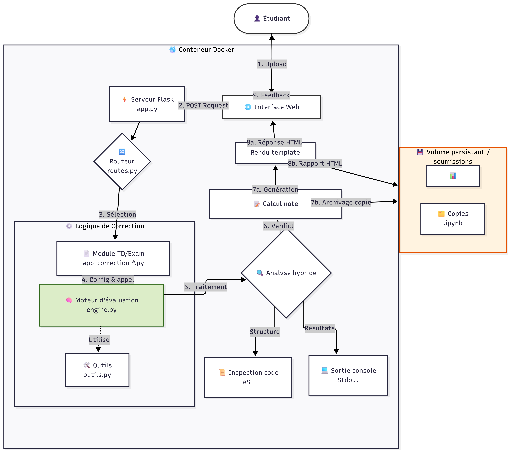

# Correcteur automatique de notebooks Jupyter (Bases TAL)

Une plateforme web légère et conteneurisée pour l'évaluation automatique de travaux pratiques et examens en Python (Notebooks Jupyter `.ipynb`). Conçue pour simplifier la correction dans un contexte pédagogique (TD et Contrôles).

---

## 1. Fonctionnalités clés

* **Correction instantanée** : Les étudiants reçoivent un feedback immédiat (note + détails) pour les TD (mode formatif).
* **Mode examen** : Pour les contrôles, le feedback est masqué (mode sommatif).
* **Analyse hybride** : Combine l'exécution de code (lecture des `print`) et l'analyse statique (AST) pour une robustesse maximale.
* **Centralisation** : Toutes les copies, rapports de correction et notes sont archivés automatiquement sur le serveur.
* **Architecture modulaire** : Ajout facile de nouveaux sujets sans toucher au cœur de l'application.

---

## 2. Architecture technique

L'application suit une architecture micro-service simple basée sur **Flask** et **Docker**. Elle sépare la logique de correction (moteur) de l'interface web.



*Le schéma ci-dessus illustre le flux de données depuis le dépôt de l'étudiant jusqu'à l'archivage des notes.*

---

## 3. Organisation des dossiers

Voici la structure du projet pour vous repérer rapidement :

```text
bases-tal/
├── app/                            # Code source de l'application
│   ├── app.py                      # Point d'entrée Flask
│   ├── routes.py                   # Définition des URL et du routeur
│   ├── engine.py                   # Moteur de correction générique (Cœur du système)
│   ├── outils.py                   # Fonctions utilitaires (logs, extraction)
│   ├── app_correction_*.py         # Modules de correction (un par devoir)
│   ├── templates/                  # Templates HTML (Jinja2)
│   │   ├── selector_template.html  # Page d'accueil
│   │   └── corrector_template.html # Rapport de correction
│   └── static/                     # Fichiers CSS/JS/Images
├── soumissions/                    # (Généré) Stockage des données
│   ├── Notes.csv                   # Tableau récapitulatif des notes
│   └── [id-devoir]/                # Un dossier par devoir
│       ├── NOM_Prenom_Copie.ipynb  # Copie originale
│       └── NOM_Prenom_Rapport.html # Rapport de correction
├── Dockerfile                      # Configuration de l'image Docker
├── docker-compose.yml              # Orchestration du conteneur
├── requirements.txt                # Dépendances Python
└── README.md                       # Ce fichier
```
## 4. Mode opératoire de déploiement
Sécurité et variables d'environnement

L'application utilise des variables d'environnement pour isoler les paramètres critiques du code source. Cela permet de sécuriser l'infrastructure, notamment lors d'un déploiement via Docker.

- FLASK_SECRET_KEY : Utilisée par Flask pour signer les sessions. Si elle n'est pas définie dans l'environnement, une clé par défaut est utilisée (cle_secrete_bases_tal_2026).

- EVALUATION_URL : Utilisée par le script batch_submitter.py pour cibler le serveur d'évaluation.
 
- Configuration proxy : L'application utilise ProxyFix pour gérer correctement les adresses IP derrière un reverse-proxy (Nginx, Traefik), configuré pour faire confiance à un niveau de headers X-Forwarded-*.

### Pré-requis
* **Docker** et **Docker Compose** installés sur la machine hôte.

### Installation et lancement

1.  **Cloner le dépôt** :
    ```bash
    git clone <votre_depot_git>
    cd bases-tal
    ```

2.  **Lancer le service** (construction et démarrage en arrière-plan) :
    ```bash
    docker compose up -d --build
    ```

3.  **Accès** :
    L'application est accessible via votre navigateur à l'adresse : `http://localhost:2025` (ou l'IP de votre serveur).

4.  **Arrêt / maintenance** :
    Pour arrêter le service :
    ```bash
    docker compose down
    ```
    Pour voir les logs en temps réel (utile pour déboguer) :
    ```bash
    docker compose logs -f
    ```

---

## 5. Guide enseignant : ajouter un nouveau devoir

Pour ajouter un nouveau TD ou contrôle, suivez ces 3 étapes simples :

### Étape A : créer le fichier de correction
Dupliquez un fichier existant (ex: `app/app_correction_TD6_S2.py`) et nommez-le pour votre nouveau devoir (ex: `app/app_correction_TD7_S2.py`).

Ouvrez ce fichier et modifiez uniquement les constantes de configuration en haut :

```python
EVAL_ID = "td7-s2"          # Identifiant unique (minuscules, sans espaces)
MAX_SCORE_TOTAL = 20.0      # Note maximale
```

# Réponses attendues (exactes, approchées et différents types listes, dicts...)
CORRECT_ANSWERS = {
    'Q1': 42,
    'Q2': ['chat', 'chien'],
    'Q3': {'a': 1, 'b': 2}
}

# Barème par question
POINTS_BREAKDOWN = {
    'Q1': 2.0,
    'Q2': 3.0,
    'Q3': 15.0
}
### Étape B : enregistrer l'évaluateur
Ouvrez le fichier `app/routes.py`. Cherchez le dictionnaire `EVALUATORS` et ajoutez votre nouvelle entrée :

```python
EVALUATORS = {
    # ... autres évaluations ...
    'td7-s2': ('TD7 - Analyse de corpus', 'app_correction_TD7_S2'),
}
```
*Note : Le premier élément est le titre affiché sur l'accueil, le second est le nom du fichier Python créé à l'étape A (sans .py).*

### Étape C : mise à jour
Pour que les modifications soient prises en compte, relancez le conteneur :
```bash
docker compose up -d --build
```
## 6. Récupération des notes et archivage

Les résultats sont stockés de manière persistante dans le dossier soumissions/ à la racine du projet (ce dossier est lié au volume Docker).

- soumissions/tdX-sY/Groupe/Notes.csv : contient l'historique complet de toutes les soumissions (date, évaluation, nom, prénom, note, classe).
- Archivage : Chaque fichier soumis par un étudiant est renommé et sauvegardé dans le sous-dossier correspondant :
  - soumissions/tdX-sY/Groupe/nb/NOM_PRENOM_Fichier.ipynb (Copie originale) 
  - soumissions/tdX-sY/Groupe/rapport/NOM_PRENOM_Rapport.html (Rapport de correction généré)
